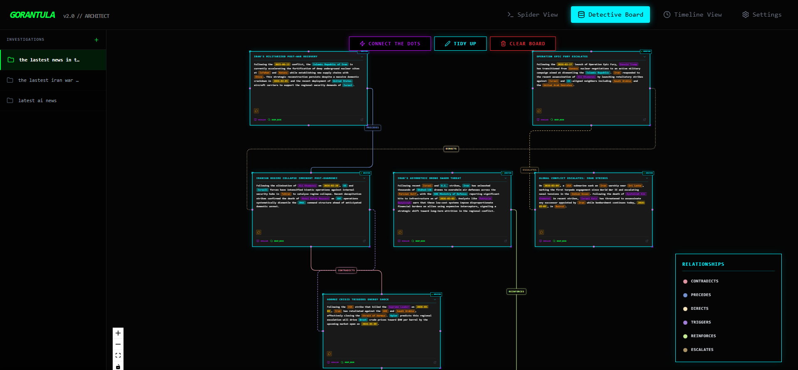
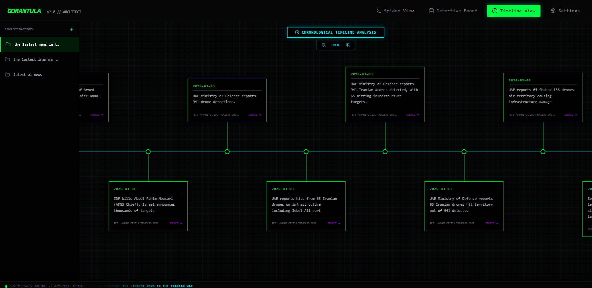

# GORANTULA v2.0 // ARCHITECT




**Gorantula** is a multi-threaded, AI-powered intelligence agent designed to crawl, digest, and visualize complex research topics. By orchestrating a "Nervous System" of concurrent "Legs," it scrapes the web for raw facts and uses supported AI providers to synthesize connections and visualize them on an interactive detective board.

---

## 🚀 Key Features

- **Concurrent Crawling**: Deploys 8 parallel scraping workers (Legs) to gather information from disparate sources simultaneously.
- **Cross-Case Synthesis Engine**: The "Grand Unified Theory" background engine silently analyzes incoming evidence against your entire historical archive of past investigations using a persistent, $O(1)$ Inverted Entity Index. It automatically alerts you via floating UI notifications if a person, organization, or location from today's case was previously discovered months ago in an unrelated investigation.
- **RAG Vault Chatbot**: Interrogate your archived investigations natively. Select multiple historical case files from the interactive Checklist UI and ask the AI specific questions; it dynamically enforces strict constraints to answer *only* based on the provided evidence.
- **Audio/Video Media Transcription**: Send YouTube, Vimeo, or standard audio/video URLs (.mp4, .mp3, etc.) straight into the crawler. If the currently routed AI provider supports multimodal parsing, it physically rips the media and extracts the intelligence. If not, a Graceful Fallback dynamically intercepts the payload without crashing the investigation.
- **Date-Aware AI**: The central Brain contextually limits searches and connects data via chronological relation to the absolute exact current date, ensuring modern timeline accuracy.
- **Robust Multi-Byte Parsing**: Advanced `rune` UTF-8 token handling ensures foreign languages (Chinese, Japanese) parsing is pristine without bytes-truncation corruption.
- **3D WebGL Spider View**: Next-gen visually stunning React Three Fiber data pipeline flow, visualizing live task delegation to parallel worker legs.
- **Detective Board**: A React Flow-powered visualization interface that maps gathered intelligence as interactive nodes with dynamic edge-wiring.
- **Interactive Timeline**: A dedicated horizontal, scrubbable timeline view plotting chronologically relevant events on a mathematically infinite virtual floating canvas, allowing for buttery smooth drag-panning and dynamic scaling.
- **Multi-Agent Persona Analysis**: "Connect The Dots" runs 6 specialized AI personas in parallel to analyze evidence from different angles:
  - **Skeptic** — Questions assumptions, finds gaps and contradictions
  - **Connector** — Finds hidden links between different pieces of info
  - **Timeline Analyst** — Orders events chronologically, spots causality
  - **Entity Hunter** — Identifies key people, orgs, and locations
  - **Context Provider** — Adds historical background and explains jargon
  - **Implications Mapper** — Evaluates consequences and predicts outcomes
  Results are synthesized by the AI into distinct relationship tags based on what the personas investigated.
- **Draggable Relationship Edges**: Custom graph wire-routing allows users to click and drag the actual relationship words to act as physical waypoints, cleanly bending and re-routing the connecting SVG lines around other cards to declutter dense network views. Double-click the label to snap it back instantly.
- **Universal Connection Ports**: Dynamically generated, load-balanced universal connection nodes scale on hover and act as omni-directional tether points without enforcing strict left/right input-output bounds, enabling fluid line layout mapping.
- **AI-Decided Connections**: Rather than relying on hardcoded tag lists, the AI analysis engine explicitly decides the best specific word to describe the relationship between two nodes based on context. These dynamic relationships are automatically assigned unique hashed color-coding and dashed line styling on the fly.
- **Multi-Model Routing & Safe Fallbacks**: Supports a vast array of AI models for analysis. Users can explicitly route distinct LLMs to specific tasks (e.g., using DeepSeek for searching, and Gemini for Persona Analysis). Includes a robust thread-safe fallback mechanism that intercepts API failures and seamlessly re-routes prompts to the next available active provider without interrupting the investigation.
- **Provider Agnostic**: Native integration for Google Gemini, Anthropic Claude, OpenAI, DeepSeek, Qwen, GLM, Kimi, Ollama, and LM Studio.
- **Auto-Layout**: Integrated Dagre graph engine ensuring clean, structured, and non-overlapping board organization.
- **Investigation Persistence**: Fast, popup-free instant-switching between research projects with seamless LocalStorage transitions and marquee UX.
- **Intel Vault**: Every successful crawl is automatically archived as a markdown report in the timestamped `abdomen_vault`.

## 🛠️ Tech Stack

- **Backend**: Go (Gorilla WebSockets, Google GenAI SDK)
- **Frontend**: React, TypeScript, Vite, Tailwind CSS (v4)
- **Visualization**: React Flow, Dagre
- **AI Engine**: Dynamic multi-model routing supporting Gemini, Anthropic, OpenAI, DeepSeek, Qwen, Ollama, and more via a generic `/v1/chat/completions` provider architecture.
- **Search Engine**: Brave Search API

---

## 📋 Setup Guide

### 1. Prerequisites
- **Go** (1.21+)
- **Node.js** (v18+) & **npm** or **pnpm**
- **Brave Search API Key**: [Get it here](https://api.search.brave.com/app/dashboard)
- **Google Gemini API Key**: [Get it here](https://aistudio.google.com/app/apikey)
- **MiniMax API Key (Optional)**: [Get it here](https://platform.minimax.io) - Supports Coding Plan for high-speed inference

### 2. Environment Configuration
Create a `.env` file in the root directory (or copy from `.env.example`). You can configure these directly in the application UI under the "Settings" tab without needing to restart the server:
```bash
GEMINI_API_KEY=your_gemini_api_key
BRAVE_API_KEY=your_brave_api_key
# Optional Providers:
OPENAI_API_KEY=
ANTHROPIC_API_KEY=
DEEPSEEK_API_KEY=
QWEN_API_KEY=
GLM_API_KEY=
KIMI_API_KEY=
MINIMAX_API_KEY=
OLLAMA_HOST=http://localhost:11434
LMSTUDIO_HOST=http://localhost:1234
```

### 3. Installation

**Backend Setup:**
```bash
go mod download
```

**Frontend Setup:**
```bash
cd frontend
npm install
```

---

## 🎮 How to Run

### Start the Backend
From the root directory:
```bash
go run main.go
```
The server will start on `localhost:8080`.

### Start the Frontend
From the `frontend` directory:
```bash
npm run dev
```
Open your browser to the local Vite URL (usually `localhost:5173`).

---

## 🕵️ Operation Instructions

1. **Initiate Crawl**: Go to the "Spider View" and enter a research topic (e.g., "Future of fusion energy"). The AI will parse this intelligently using today's exact date.
2. **Watch the WebGL Spider**: Observe the 3D visualizer map out the "Nervous System." You will see 8 distinct worker legs pulse with activity, lock onto targets, and glow as data physically returns to the central core.
3. **Analyze the Board**: Head over to the "Detective Board" tab. Watch as cards "pop in" with AI-generated summaries. You can safely resize cards for a better fit or use the mini-map to overview massive case networks.
4. **Connect The Dots**: Once gathering is complete, click the **[ CONNECT THE DOTS ]** button. The board will automatically organize itself into a logical hierarchy, connecting topics with distinct visual evidence wires. These relationship tags are explicitly decided by the AI analysis engine investigating the context, rather than a hardcoded list. Users can freely drag the dynamically generated relationship labels around to manually re-route and bend the visual connection lines to their liking!
5. **Read Deep**: Click "READ FULL" on any card to slide out the complete Intel Report, fully parsed and untruncated even if in multi-byte languages.
6. **Timeline Analysis**: Toggle to the "Timeline" view to see dates extracted from reports logically laid out chronologically on a virtual floating canvas. Smoothly drag and zoom to investigate cascading historical implications!
7. **Switch Topics**: Use the fast, popup-free sidebar to rapidly ditch old investigations and swap seamlessly into new cases while monitoring the lower Status Ticker.
8. **Interrogate Vault**: Open the "Vault Chat" tab anytime to review past investigations. Select multiple`.md` files using the dropdown, and chat with the AI exclusively bounded by the contents of those documents.
