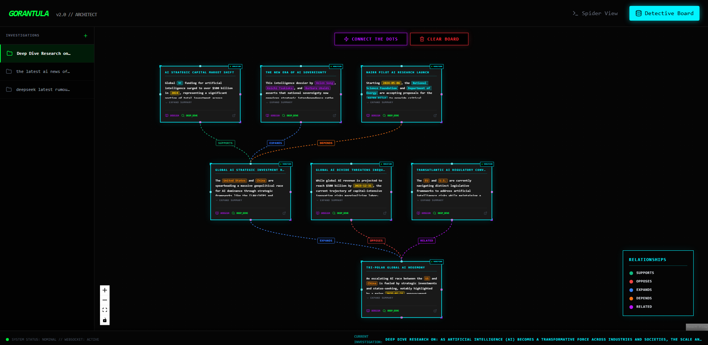

# GORANTULA v2.0 // ARCHITECT



**Gorantula** is a multi-threaded, AI-powered intelligence agent designed to crawl, digest, and visualize complex research topics. By orchestrating a "Nervous System" of concurrent "Legs," it scrapes the web for raw facts and uses Gemini 3 Flash to synthesize connections and visualize them on an interactive detective board.

---

## 🚀 Key Features

- **Concurrent Crawling**: Deploys 8 parallel scraping workers (Legs) to gather information from disparate sources simultaneously.
- **Date-Aware AI**: The central Brain contextually limits searches and connects data via chronological relation to the absolute exact current date, ensuring modern timeline accuracy.
- **Robust Multi-Byte Parsing**: Advanced `rune` UTF-8 token handling ensures foreign languages (Chinese, Japanese) parsing is pristine without bytes-truncation corruption.
- **3D WebGL Spider View**: Next-gen visually stunning React Three Fiber data pipeline flow, visualizing live task delegation to parallel worker legs.
- **Detective Board**: A React Flow-powered visualization interface that maps gathered intelligence as interactive nodes with dynamic edge-wiring.
- **Intelligent Relationships**: "Connect The Dots" draws distinct visual relations (`SUPPORTS` [solid green], `OPPOSES` [dashed red], `EXPANDS`/`DEPENDS` [cyan/orange]) using multiple card ports to eliminate graph-tangle.
- **Auto-Layout**: Integrated Dagre graph engine ensuring clean, structured, and non-overlapping board organization.
- **Investigation Persistence**: Fast, popup-free instant-switching between research projects with seamless LocalStorage transitions and marquee UX.
- **Intel Vault**: Every successful crawl is automatically archived as a markdown report in the timestamped `abdomen_vault`.

## 🛠️ Tech Stack

- **Backend**: Go (Gorilla WebSockets, Google GenAI SDK)
- **Frontend**: React, TypeScript, Vite, Tailwind CSS (v4)
- **Visualization**: React Flow, Dagre
- **AI Engine**: Google Gemini 3 Flash
- **Search Engine**: Brave Search API

---

## 📋 Setup Guide

### 1. Prerequisites
- **Go** (1.21+)
- **Node.js** (v18+) & **npm**
- **Brave Search API Key**: [Get it here](https://api.search.brave.com/app/dashboard)
- **Google Gemini API Key**: [Get it here](https://aistudio.google.com/app/apikey)

### 2. Environment Configuration
Create a `.env` file in the root directory (or copy from `.env.example`):
```bash
GEMINI_API_KEY=your_gemini_api_key
BRAVE_API_KEY=your_brave_api_key
```

### 3. Installation

**Backend Setup:**
```bash
go mod download
```

**Frontend Setup:**
```bash
cd frontend
npm install
```

---

## 🎮 How to Run

### Start the Backend
From the root directory:
```bash
go run main.go
```
The server will start on `localhost:8080`.

### Start the Frontend
From the `frontend` directory:
```bash
npm run dev
```
Open your browser to the local Vite URL (usually `localhost:5173`).

---

## 🕵️ Operation Instructions

1. **Initiate Crawl**: Go to the "Spider View" and enter a research topic (e.g., "Future of fusion energy"). The AI will parse this intelligently using today's exact date.
2. **Watch the WebGL Spider**: Observe the 3D visualizer map out the "Nervous System." You will see 8 distinct worker legs pulse with activity, lock onto targets, and glow as data physically returns to the central core.
3. **Analyze the Board**: Head over to the "Detective Board" tab. Watch as cards "pop in" with AI-generated summaries. You can safely resize cards for a better fit or use the mini-map to overview massive case networks.
4. **Connect The Dots**: Once gathering is complete, click the **[ CONNECT THE DOTS ]** button. The board will automatically organize itself into a logical hierarchy, connecting topics with distinct visual evidence wires (`SUPPORTS` = solid green, `OPPOSES` = dashed red, etc.).
5. **Read Deep**: Click "READ FULL" on any card to slide out the complete Intel Report, fully parsed and untruncated even if in multi-byte languages.
6. **Switch Topics**: Use the fast, popup-free sidebar to rapidly ditch old investigations and swap seamlessly into new cases while monitoring the lower Status Ticker.
