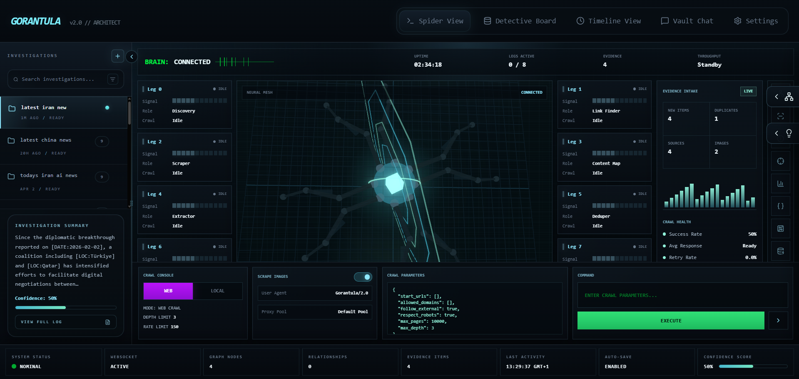
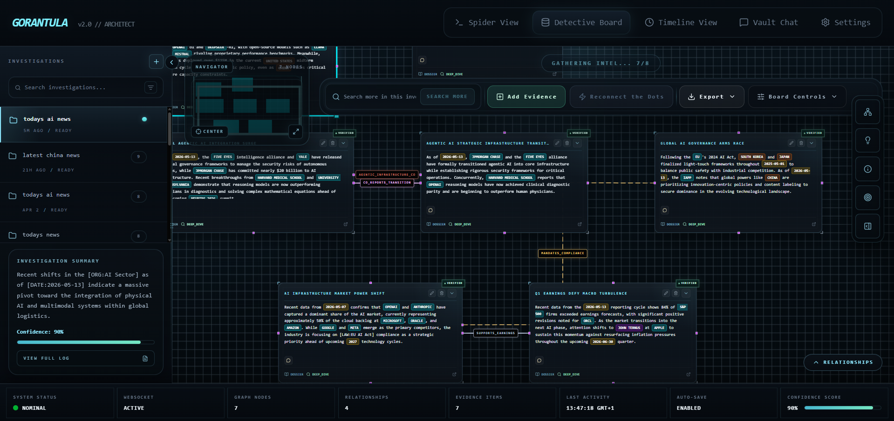
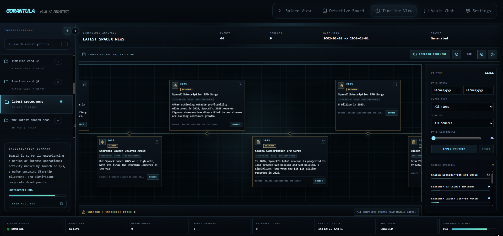
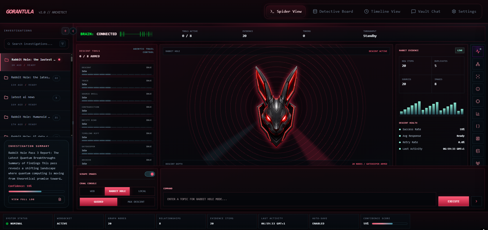

# Gorantula

Gorantula is a local-first intelligence research workspace. It crawls a topic, gathers evidence, synthesizes it with configurable AI providers, and turns the result into a forensic board, timeline, and searchable vault - and it remembers across investigations with an event-driven memory brain that prepares next moves under guarded autonomy.

## Preview





## What It Does

- Runs concurrent web crawling with multiple worker legs.
- Supports Web, Local, and Rabbit Hole crawl modes from Spider View.
- Builds an interactive Detective Board from gathered evidence.
- Extracts deterministic, board-derived events into the Timeline View.
- Archives successful investigations into the local `abdomen_vault`.
- Lets you interrogate archived evidence through Vault Chat.
- Surfaces Brain Signals that connect the active investigation to older related cases.
- Supports discovery review, relationship mapping, draggable graph labels, and source-linked evidence cards.
- Adds a Rabbit Hole mode for deeper pass-based research, Gatekeeper review, optional image scraping, supporting evidence bands, and final relationship synthesis.
- Uses configurable AI routing with DeepSeek as the default day-to-day provider.
- Supports Gemini, OpenAI, Anthropic, Qwen, GLM, Kimi, MiniMax, Ollama, LM Studio, and compatible `/v1/chat/completions` providers.



## Rabbit Hole Mode

Rabbit Hole is the deep-investigation crawl mode. It starts from Spider View, creates or continues an investigation, and runs agentic research passes that can combine fresh web searches, saved-vault echoes, timeline context, and optional image scraping.

- `Guided` runs a pass, shows the Gatekeeper recommendation, then waits for the operator to continue or stop.
- `Max Descent` continues automatically until the Gatekeeper stops or the hard pass cap is reached.
- Rabbit Hole nodes are marked on the board and promoted after the descent finishes.
- Relationship synthesis and board cleanup run once at the end, so the board does not churn after every pass.
- Relevant unconnected Rabbit Hole evidence is kept in a compact Supporting Evidence layer instead of being hidden or deleted.
- Rabbit Hole runs write detailed traces under `abdomen_vault/rabbit-hole-logs`.

## Brain Signals

Brain Signals is Gorantula's durable memory layer. The brain fires by itself whenever evidence lands - no tab-open required - and routes each event through deterministic recall gateways to surface connections between the active investigation and older cases.

- Event-driven: evidence saves trigger a backend recompute, websocket pulses light up the living memory map, and a badge tracks unseen or strengthened signals per case (persisted, so it survives refreshes).
- Built-in gateways: entity/date overlap, source-domain overlap, and relationship-tag overlap - held in a persisted, addressable registry with usage stats, route trails, and rename/disable from the UI.
- The pulse feed ranks signals, next moves, and autonomy decisions in one stream; the Memory surface merges the map, durable memory links, and clusters.
- Promoting a signal creates a durable Memory Link; repeated firings reinforce it with activation counts instead of duplicating cards.
- Suggestions carry thinking-gateway provenance and can auto-attach source evidence: saved board evidence first, then a bounded web lookup, with a cooldown to prevent lookup storms.

## Guarded Autonomy

The brain prepares next moves by itself but never launches anything without the operator.

- Modes: `off`, `suggest-only`, `limited-background`, and `prepare-only`.
- In `prepare-only`, qualified suggestions become prepared focused Rabbit Hole follow-ups - each requires explicit operator approval before launching; nothing starts automatically.
- Multi-candidate evaluation: every launch-ready candidate is evaluated in rank order, each preparation consumes the configured budgets (`MaxAutoPreparedPerInvestigation`, `MaxActivePrepared`), and every non-prepared candidate gets an audited blocked/would-prepare decision with its reasons.
- Every decision is written to the autonomy audit trail with its stream provenance (source signals + gateway).

## How a Scan Runs

1. The prompt is decomposed into search angles (4-12 queries).
2. Eight parallel legs search the Brave Search API and scrape the top results per leg (default 4, tunable via `GORANTULA_LEG_SOURCES`).
3. Pages are extracted with container-first parsing (article/main content first, whole-document paragraphs as fallback).
4. Each gathered nutrient is summarized into an evidence node; duplicates are merged; facts are ranked against the prompt for the final report.
5. Seven personas analyze the board in parallel, relationship synthesis proposes and quality-filters connections, and a strict discovery pass only surfaces non-obvious cross-node patterns.
6. Provider hiccups self-heal: content-filtered prompts are retried with sanitized wording, empty/truncated responses and rate limits retry with backoff, and every model call is recorded to `pipeline-traces/pipeline-trace.jsonl`.
7. DeepSeek V4 models run with thinking mode disabled by default (the hidden chain-of-thought would otherwise exhaust the output budget); opt back in with `DEEPSEEK_THINKING=low|high|max`.

## Scientific research verification

Research → Verification now includes built-in local statistics and data-figure
tools, manual or LLM-directed runs, downloadable evidence bundles, and replay
without a model. No Docker or Python setup is required. See the
[verification guide](internal/research/VERIFICATION.md) for supported calculations,
input limits, agent data sharing, and the standalone replay command.

## Tech Stack

- Backend: Go, Gorilla WebSockets
- Frontend: React, TypeScript, Vite, Tailwind CSS
- Graphs: React Flow, Dagre
- 3D view: React Three Fiber / Three.js
- Search: Brave Search API
- Storage: local browser persistence plus backend vault files

## Prerequisites

- Go 1.21 or newer
- Node.js 18 or newer
- npm
- Brave Search API key
- DeepSeek API key, unless you configure another provider in Settings

Optional local providers:

- Ollama at `http://localhost:11434`
- LM Studio at `http://localhost:1234/v1`

## Quick Start

From the repository root:

```powershell
go mod download
Copy-Item .env.example .env
```

Install frontend dependencies:

```powershell
cd frontend
npm.cmd install
```

Start the backend from the repository root:

```powershell
go run ./cmd/gorantula
```

The backend runs at:

```text
http://127.0.0.1:8080
```

Start the frontend from `frontend`:

```powershell
npm.cmd run dev -- --host 127.0.0.1 --port 5173
```

Open:

```text
http://127.0.0.1:5173/
```

## Environment Setup

Create `.env` from `.env.example`, then add at least:

```env
BRAVE_API_KEY=your_brave_api_key
GORANTULA_HOST=127.0.0.1
GORANTULA_PORT=8080
DEEPSEEK_ENABLED=true
DEEPSEEK_API_KEY=your_deepseek_api_key
DEEPSEEK_MODEL=deepseek-v4-flash
DEFAULT_SEARCH_MODEL=deepseek
DEFAULT_PERSONA_MODEL=deepseek
```

Optional tuning knobs:

```env
# DeepSeek V4: disable or dial back hidden reasoning (enabled high by default;
# reasoning tokens share the max_tokens budget with the answer)
DEEPSEEK_THINKING=disabled
# How many Brave results each crawl leg scrapes (default 4, clamped 1-8)
GORANTULA_LEG_SOURCES=4
# Parallel node-summary workers during gathering (default 8, clamped 1-12)
GORANTULA_NODE_SUMMARY_CONCURRENCY=8
```

Optional provider switches:

```env
GEMINI_ENABLED=false
OPENAI_ENABLED=false
ANTHROPIC_ENABLED=false
DASHSCOPE_ENABLED=false
ZHIPUAI_ENABLED=false
MOONSHOT_ENABLED=false
MINIMAX_ENABLED=false
OLLAMA_ENABLED=false
LMSTUDIO_ENABLED=false
```

Provider keys and local hosts:

```env
GEMINI_API_KEY=
OPENAI_API_KEY=
ANTHROPIC_API_KEY=
DASHSCOPE_API_KEY=
ZHIPUAI_API_KEY=
MOONSHOT_API_KEY=
MINIMAX_API_KEY=
OLLAMA_HOST=http://localhost:11434
LMSTUDIO_BASE_URL=http://localhost:1234/v1
LM_API_TOKEN=
```

Model overrides:

```env
GEMINI_MODEL=gemini-3-flash-preview
OPENAI_MODEL=gpt-5.4-mini
ANTHROPIC_MODEL=claude-sonnet-4-6
DASHSCOPE_MODEL=qwen3.6-plus
ZHIPUAI_MODEL=glm-5-turbo
MOONSHOT_MODEL=kimi-k2.6
MINIMAX_MODEL=MiniMax-M2.7-highspeed
OLLAMA_MODEL=qwen3-coder
LMSTUDIO_MODEL=qwen3.6
```

Provider switches are separate from credentials. Set `*_ENABLED=true` only for providers you want Gorantula to route to.

## Daily Development Commands

Backend:

```powershell
go run ./cmd/gorantula
go test ./...
```

Frontend:

```powershell
cd frontend
npm.cmd run dev -- --host 127.0.0.1 --port 5173
npm.cmd run test
npm.cmd run build
```

Smoke tests:

```powershell
cd frontend
npm.cmd run test:smoke
```

The Playwright smoke suite runs Vite in test mode with a fake browser WebSocket and blocks non-local network requests, so it does not require the Go backend, API keys, Brave Search, or model calls. It covers normal web board creation, Rabbit Hole guided continuation, Rabbit Hole max promotion/support evidence, normal synthesis theming, board restore after refresh, Brain Signal promotion persistence, backend error recovery, and Rabbit Hole-to-Web mode isolation.

On Windows, the first backend start may trigger a Windows Defender Firewall prompt. Allowing private-network access is expected for local development.

## Workflow

1. Open Spider View, pick `Web`, `Local`, or `Rabbit Hole`, and enter a research topic.
2. Watch the worker legs gather sources and evidence.
3. For Rabbit Hole, choose `Guided` or `Max Descent` and review Gatekeeper decisions as the run deepens.
4. Open Detective Board to inspect evidence cards, supporting evidence, and relationships.
5. Use Connect the Dots to synthesize relationships when a normal crawl is complete; Rabbit Hole runs trigger final synthesis automatically.
6. Open Timeline View and generate or refresh the timeline from saved board evidence.
7. Use Vault Chat to select archived evidence files and ask grounded questions.
8. Review generated markdown reports in `abdomen_vault`.

## Project Notes

- Timeline generation is manual and local to the selected investigation.
- Vault Chat answers are scoped to the selected vault evidence files.
- Browser persistence is used for fast local investigation switching.
- Backend vault files provide durable markdown archives for completed investigations.
- Discovery debug traces are written under `abdomen_vault/discovery_logs`.
- Rabbit Hole debug traces are written under `abdomen_vault/rabbit-hole-logs`.

## Troubleshooting

- If the frontend opens on `localhost` instead of `127.0.0.1`, use:

  ```powershell
  npm.cmd run dev -- --host 127.0.0.1 --port 5173
  ```

- If Vault Chat cannot load files, confirm the backend is running at `http://127.0.0.1:8080`.
- If searches fail, check `BRAVE_API_KEY`.
- If AI calls fail, check that the matching provider has both `*_ENABLED=true` and a valid key or local host.
- If a board or timeline looks stale, refresh the active investigation data from the UI before re-running analysis.

### Research publication (Phase 4)

The Scientific Research **Publish** view prepares a source-linked candidate paper,
exports figure specifications, accepts operator-generated PNGs, and records
revision-specific approval before creating a local repo-ready evidence package.
Corpus changes invalidate publication approval. Export never commits or pushes;
see [publication workflow](internal/research/PUBLICATION.md) for limits and paths.

### Research supplements and source screening

Paper discovery queries Crossref, arXiv and Europe PMC through their official APIs, then uses OpenAlex if fewer than the requested number of distinct readable papers are available. No Python client installation or additional key is required for these providers. Results are ranked for screening and deduplicated by DOI, title and record ID. The service caches provider/query results in memory for 24 hours (up to 128 entries), spaces arXiv calls, and honours rate-limit cooldowns while continuing with other providers. Every topic run retains provider errors, counts and cache usage in its evidence and report. arXiv/posted-content records carry explicit peer-review uncertainty; metadata-only records without abstracts cannot become evidence. These search providers do not guarantee access to full text or raw data.

The continuous research pipeline screens retrieved papers before proposing findings. It records direct, indirect, or irrelevant topic relevance; distinguishes reviews from primary studies; and retains server-selected source excerpts and limitations. Irrelevant papers are excluded. OpenAlex records marked retracted, retraction notices, and paratext are excluded from retrieval. Unknown or missing metadata is not proof of reliability.

The local `paper-docx` agent tool reads DOCX supplementary text and rectangular Word tables. The advanced Research data tools panel also exposes it. `paper-table` saves a retained table using its exact extraction ID (DOCX uses page 0); the source bytes and table values remain in preparation evidence. Ambiguous merged, nested, revised, or irregular tables are withheld instead of guessed. DOCX XML is bounded to 8 MiB and no embedded code or external objects are executed. For observed PMC DOCX links, an HTML download gate or failed download triggers a bounded fallback to the official public PMC S3 repository. It verifies the article ID, exact filename, open-access/retraction metadata and MD5 checksum, and retains the resolved source URL. Multiple matching versions require review; it never guesses a version. Other access problems remain explicit.

Every newly selected dataset receives automatic structural validation. These checks detect missing/mixed cells, duplicate rows, and unspecified units; they do not establish independent observations, parent-paper provenance, or scientific truth. The agent and report reviewers must assess topic/population/outcome fit and distinguish summary statistics from original observations. Screening assessments appear in the report and PDF. A literature-only result is valid when relevant measurements cannot be obtained.

Deterministic coverage: `go test ./internal/research`. The optional public download check uses `GORANTULA_TEST_LIVE_DOCX=1 go test ./internal/research -run TestDOCXLiveSupplement -count=1 -v` (set the environment variable separately in PowerShell); it exercises the official repository fallback and can fail if that service or file is unavailable.
